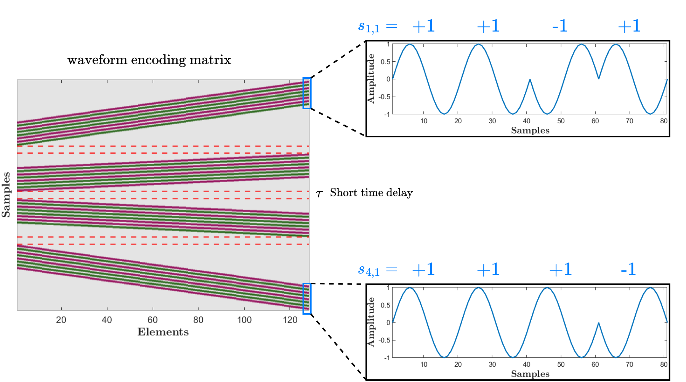
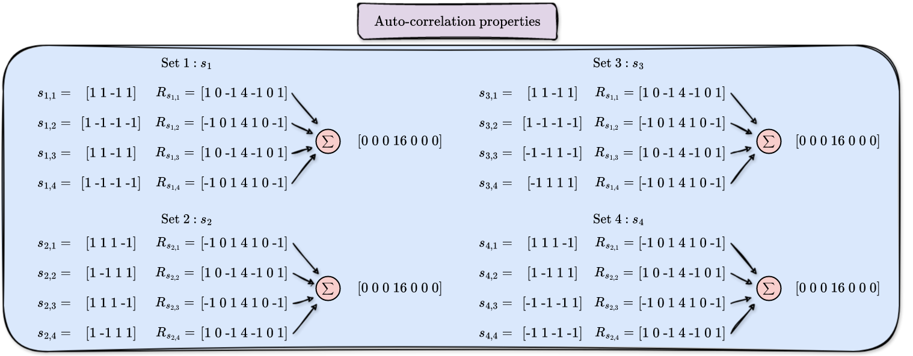
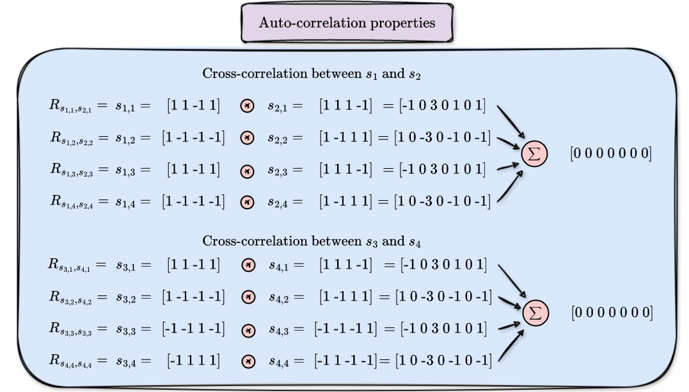

# Complete Complementary Codes for Coded Excitation Ultrasound Imaging

This repository contains the MATLAB code to generate **Complete Complementary Codes (CCC)** as described in the following paper:

**Tamraoui, M., Bernard, A., Roux, E., & Liebgott, H.**  
*Complementary Coded Multiplane Wave Sequences for SNR Increase in Ultrafast Power Doppler Ultrasound Imaging*  
IEEE Transactions on Ultrasonics, Ferroelectrics, and Frequency Control.

---

## Overview

Power Doppler imaging is a commonly used technique for visualizing blood flow in ultrasound imaging. This technique measures flow amplitude rather than velocity, and it relies on detecting the power of Doppler signals, making it particularly useful for detecting weak blood flow. The emergence of coherent plane wave compounding has enabled significant progress in ultrafast power Doppler imaging. However, the lack of transmit focusing leads to low Signal-to-Noise Ratio (SNR) and contrast, thereby reducing the sensitivity to blood flow, particularly in deep tissue regions. We propose to increase the SNR and contrast of ultrafast power Doppler imaging by leveraging the ideal correlation properties of Complete Complementary Codes (CCC) for Multi-Plane Wave Imaging (MPWI). The MPWI-CCC method consists of transmitting quasi-simultaneously N tilted plane waves coded with a binary sequence of length L. Subsequently, the backscattered signals from each plane wave are individually recovered with high amplitude through decoding. We compared MPWI-CCC and Multi-plane Wave Imaging with Hadamard encoding (MPWI-HD) against Coherent Plane Wave Compounding (CPWC) in both simulations and experiments. When transmitting four plane waves on a commercial blood flow phantom, MPWI-CCC exhibited SNR and contrast gains of 13.02dB and 10.08dB, respectively, compared to CPWC. MPWI-HD, on the other hand, achieved gains of only 6.99dB and 4.29dB, respectively. 

---

## CCC Correlation Properties
The CCC used here are defined as \((N, N, MN/P)\)-CCC, and allow control over the code length.
The figures below illustrate the ideal correlation properties of a (4,4,4)-CCC sequence set.

### Auto-Correlation

### Cross-Correlation

---

## Repository Contents

- `demoCorrelations.m` – MATLAB script to generate CCC sequences and demonstrate their correlation properties.
- `demoGenMPWI3Cwaveforms.m` – Field II example script demonstrating MPWI-CCC.
- `DAS/` – Folder containing beamforming codes.
- `functions/` – All the matlab function are here :
- `codes_N_N_MNP.m` – function that generate the binary CCC sequences (+1 and -1). Each matlab Cell corresponds to a set.
- `bandwidthMatching.m` – function is used to modulate a chip with the binary codes. +1 correspond to a phase of 0° and -1 corresponds to a phase of 180°.
- `npComplementaryCodes.m` function used to get the final bandwidth match CCC codes. Each set corresponds to a set. 
  
---

## Citations
If you use this code somehow, please cite these two papers :

**Tamraoui, M., Bernard, A., Roux, E., & Liebgott, H.**  
*Complementary Coded Multiplane Wave Sequences for SNR Increase in Ultrafast Power Doppler Ultrasound Imaging*  
IEEE Transactions on Ultrasonics, Ferroelectrics, and Frequency Control.

**Tamraoui, M., & Liebgott, H., Roux, E.**  
*Complete complementary coded excitation scheme for snr improvement of 2d sparse array ultrasound imaging*  
IEEE Transactions on Biomedical Engineering 71.3 (2023): 1043-1055.
